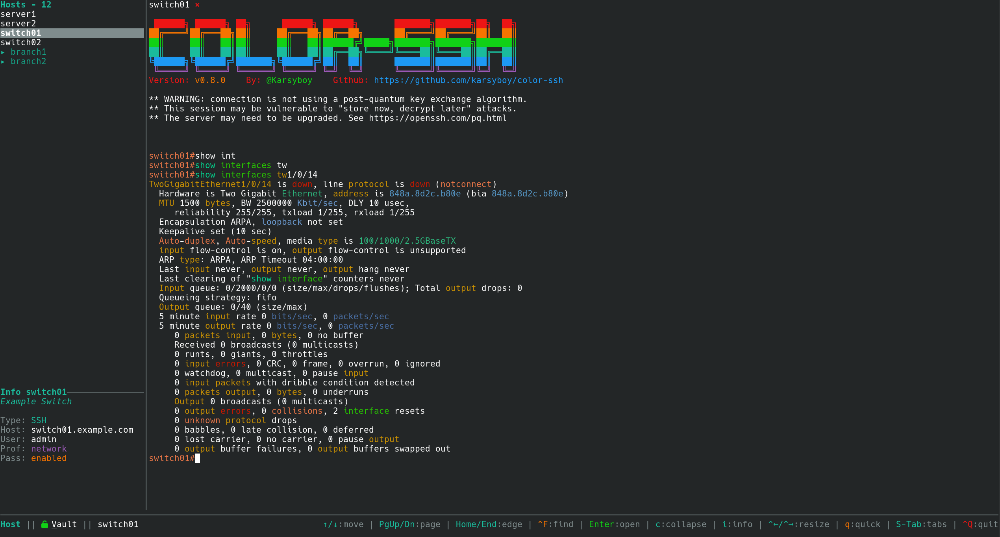

<p align="center">
  
</p>

<p align="center">
    <a href="https://github.com/karsyboy/color-ssh/releases">
        </a>
    <a href="https://crates.io/crates/color-ssh">
        </a>
  <br>
    <a href="https://github.com/karsyboy/color-ssh/actions/workflows/release-plz.yml">
        </a>
    <a href="https://github.com/karsyboy/color-ssh/actions/workflows/release.yml">
        </a>
<p>

## About

**Color SSH** (`cossh`) is a Rust-based wrapper for SSH and managed RDP launches that enhances your terminal experience with real-time syntax highlighting, shared vault access, and session logging. Built for network engineers, system administrators, and anyone who works with remote systems every day.



## Features

- Session manager TUI
- YAML inventory for SSH and RDP hosts
- Syntax highlighting
- Session logging
- Configuration hot reload
- Multiple profile support
- Configurable rules using regex matching
- Shared password vault unlock for TUI and direct mode
- RDP launch support via `xfreerdp3` or `xfreerdp`

## Quick Start

```bash
# 1) Install
cargo install color-ssh

# 2) Start interactive session manager
cossh

# 3) Launch direct SSH
cossh ssh user@example.com

# 4) Optional: import hosts from ~/.ssh/config
cossh --migrate

# 5) Optional: unlock vault for password-backed hosts
cossh vault unlock
```

## Installation

`color-ssh` supports Linux and macOS. Windows users should run it through WSL.

#### Requirement
- SSH
- `xfreerdp3` or `xfreerdp` (Optional)

### Pre-built Binaries (Recommended)
Download the latest release from [GitHub Releases](https://github.com/karsyboy/color-ssh/releases/).

### Cargo
```bash
cargo install color-ssh
```

### From Source
```bash
# Clone the repository
git clone https://github.com/karsyboy/color-ssh.git
cd color-ssh

# Build the release binary
cargo build --release
```

### Shell Completion
Shell completion scripts are included for `fish` and `zsh`. For instructions see the [Shell Completion README](shell-completion/README.md).


## Usage

```bash
Usage: cossh [OPTIONS] [COMMAND]

Commands:
  ssh    Launch an SSH session by forwarding arguments to the SSH command
  rdp    Launch an RDP session using xfreerdp3 or xfreerdp
  vault  Manage the password vault
  help   Print this message or the help of the given subcommand(s)

Options:
  -d, --debug...           Enable debug logging to ~/.color-ssh/logs/cossh.log; repeat (-dd) for raw terminal and argument tracing
  -l, --log                Enable SSH session logging to ~/.color-ssh/logs/ssh_sessions/
  -P, --profile <profile>  Specify a configuration profile to use
  -t, --test               Ignore config logging settings; only use CLI -d/-l logging flags
      --pass-entry <name>  Override the password vault entry used for a direct protocol launch
      --migrate            Migrate ~/.ssh/config host entries into ~/.color-ssh/cossh-inventory.yaml
  -h, --help               Print help
  -V, --version            Print version


cossh                                                     # Launch interactive session manager
cossh -d ssh user@example.com                             # Safe debug enabled
cossh --pass-entry office_fw <ssh/rdp> host.example.com   # Override the password entry for this launch
cossh -l ssh user@example.com                             # SSH logging enabled
cossh -l -P network ssh user@firewall.example.com         # Use 'network' config profile
cossh -l ssh user@host -p 2222                            # Both modes with SSH args
cossh ssh user@host -G                                    # Non-interactive command
cossh rdp desktop01                                       # Launch a configured RDP host
cossh --migrate                                           # Import ~/.ssh/config into the YAML inventory
```

## Documentation

The full user wiki lives in [Here](https://github.com/karsyboy/color-ssh/wiki).

## Configuration

#### Runtime Config

Configuration files are looked for in the following order:

1. **Color SSH config directory**: `~/.color-ssh/[profile].cossh-config.yaml`
2. **Home directory**: `~/[profile].cossh-config.yaml`
3. **Current directory**: `./[profile].cossh-config.yaml`

If no configuration file is found the default configuration will be created at `~/.color-ssh/cossh-config.yaml`.

#### Host Inventory

`color-ssh` loads SSH and RDP hosts from `~/.color-ssh/cossh-inventory.yaml`.

#### Common inventory fields:

| Field | What it does |
| --- | --- |
| `name` | Alias shown in the TUI and used for direct launches like `cossh ssh <name>`. |
| `protocol` | Protocol to launch, such as `ssh` or `rdp`. |
| `host` | Actual destination hostname or IP address. |
| `description` | Text shown in the TUI info/details view. |
| `profile` | Uses the matching `cossh` runtime profile when opening the host. |
| `vault_pass` | Password vault entry used for password auto-login. |
| `hidden` | Hides the host from the interactive host list and search results. |
| `identity_file`, `proxy_jump`, `proxy_command`, `forward_agent`, `local_forward`, `remote_forward`, `ssh_options` | SSH-specific connection settings. |
| `rdp_domain`, `rdp_args` | RDP-specific connection settings. |

#### Migrate from `~/.ssh/config`

Use this once to import your existing OpenSSH host entries into the YAML inventory:

```bash
cossh --migrate
```


For more info go here [TUI User Guide](docs/tui-guide.md).

## Uninstall

### Cargo
```bash
cargo uninstall color-ssh
```

### Homebrew
```bash
brew uninstall color-ssh
```

### Linux/macOS (Manual)
```bash
# 1. Remove the main binary
rm ~/.cargo/bin/cossh

# 2. Remove the updater binary
rm -f ~/.cargo/bin/color-ssh-update

# 3. (Optional) Remove configuration and logs
rm -rf ~/.color-ssh/

# 4. Remove the installation receipt
rm -rf ~/.config/color-ssh/
```

### Shell Completion Cleanup
For instructions see the [Shell Completion README](shell-completion/README.md).

## Support
If you need help, have an issue, or want to request a feature, open an [issue](https://github.com/karsyboy/color-ssh/issues/new).

## Special Thanks

Thanks to the following projects for the inspiration behind Color SSH.

- [Chromaterm](https://github.com/hSaria/ChromaTerm)
- [netcli-highlight](https://github.com/danielmacuare/netcli-highlight)

Also thank you to [Alacritty](https://github.com/alacritty/alacritty) for the terminal crate used to render the terminal in the TUI.
