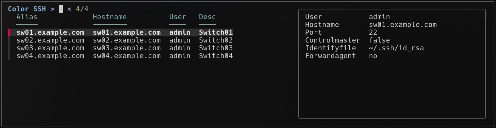

# Shell Completion for cossh




## Credits

The completion scripts in this directory are based on:
- [zsh-ssh](https://github.com/sunlei/zsh-ssh) by Sunlei - Thank you for the awesome scripts!


## Installation

### Fish Shell

#### Prerequisites
- [fzf](https://github.com/junegunn/fzf)
- fish or zsh
#### Installation Steps
   ```bash
   # Create directories if they don't exist
   mkdir -p ~/.config/fish/completions
   mkdir -p ~/.config/fish/functions
   
   # Copy the completion files
   cp fish/completions/cossh.fish ~/.config/fish/completions/
   cp fish/functions/__cossh_fzf_complete.fish ~/.config/fish/functions/
   ```

### Zsh Shell

#### Installation Steps
   ```bash
   # Create directory if it doesn't exist
   mkdir -p ~/.zsh/zsh-cossh
   
   # Copy the completion script
   cp zsh/zsh-cossh.zsh ~/.zsh/zsh-cossh/

   # Source the completion script in ~/.zshrc
   source ~/.zsh/zsh-cossh/zsh-cossh.zsh 
   ```

#### Adding Custom Descriptions

You can add descriptions to your SSH hosts by adding `#_desc` in your `~/.ssh/config`:

```ssh-config
Host myserver
    HostName example.com
    User myuser
    #_desc Production web server
```
## Uninstall
```bash
# Fish
rm -f ~/.config/fish/completions/cossh.fish
rm -f ~/.config/fish/functions/__cossh_fzf_complete.fish

# Zsh
# Remove the sourcing line from ~/.zshrc that references zsh-cossh.zsh
rm -f ~/.zsh/zsh-cossh/zsh-cossh.zsh
```

## Auto Login with sshpass using GPG Encryption

This section describes how to use `sshpass` with GPG-encrypted passwords for automated SSH login.

### Setup

1. **Encrypt your password** with GPG:
   ```bash
   nano .sshpasswd
   gpg -c .sshpasswd
   rm .sshpasswd
   ```

2. **Load the password** into an environment variable:
   ```bash
   source ssh-in.sh
   ```

3. **Connect using sshpass**:
   ```bash
   sshpass -e cossh <hostname>
   ```

4. **Clear the password** from the environment when done:
   ```bash
   source ssh-out.sh
   ```

### Tab Completion for sshpass Aliases

If you create an alias (Ex. `cosshp`) for the sshpass command you can set up tab completion:

#### Fish

Create a new completion file for your alias:
```bash
cp fish/completions/cossh.fish ~/.config/fish/completions/cosshp.fish
sed -i 's/cossh/cosshp/g' ~/.config/fish/completions/cosshp.fish
```
Then add to your `~/.config/fish/config.fish`:
```bash
alias cosshp='sshpass -e cossh'
```

#### Zsh

Create a new completion script for your alias:
```bash
cp zsh/zsh-cossh.zsh ~/.zsh/zsh-cosshp/zsh-cosshp.zsh
sed -i 's/cossh/cosshp/g' ~/.zsh/zsh-cosshp/zsh-cosshp.zsh
```

Then add to your `~/.zshrc`:
```bash
source ~/.zsh/zsh-cosshp/zsh-cosshp.zsh
alias cosshp='sshpass -e cossh'
```